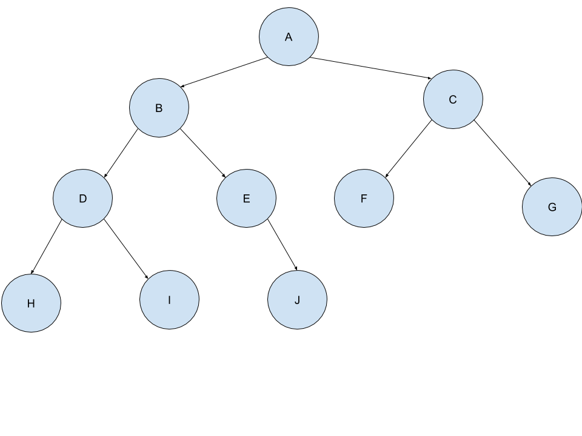
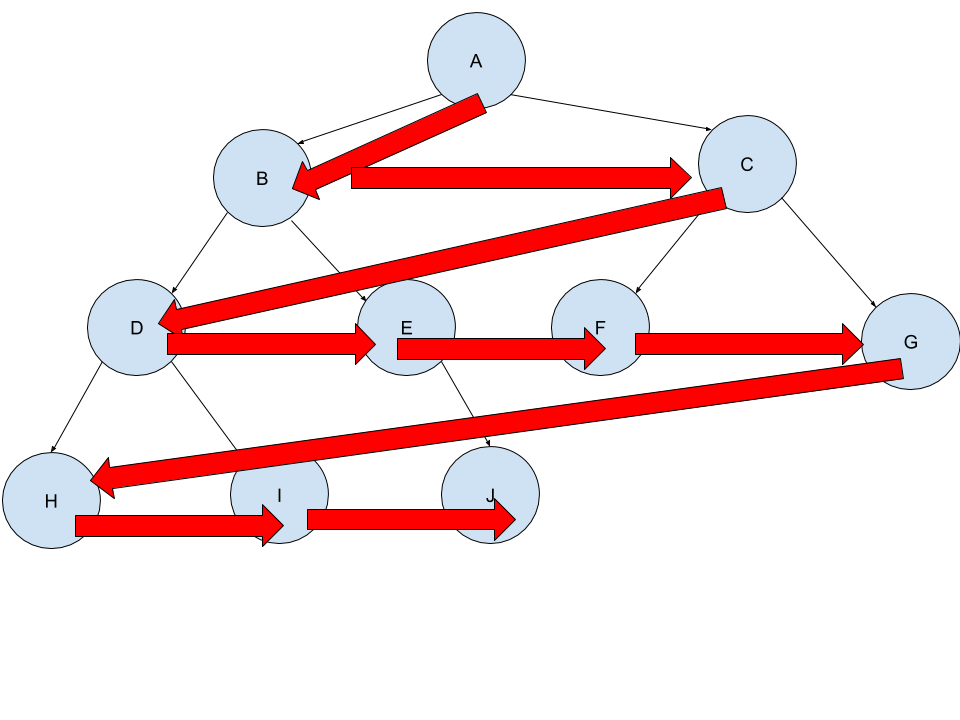
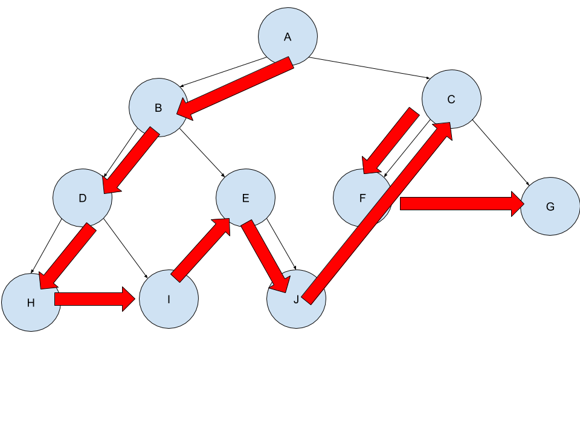
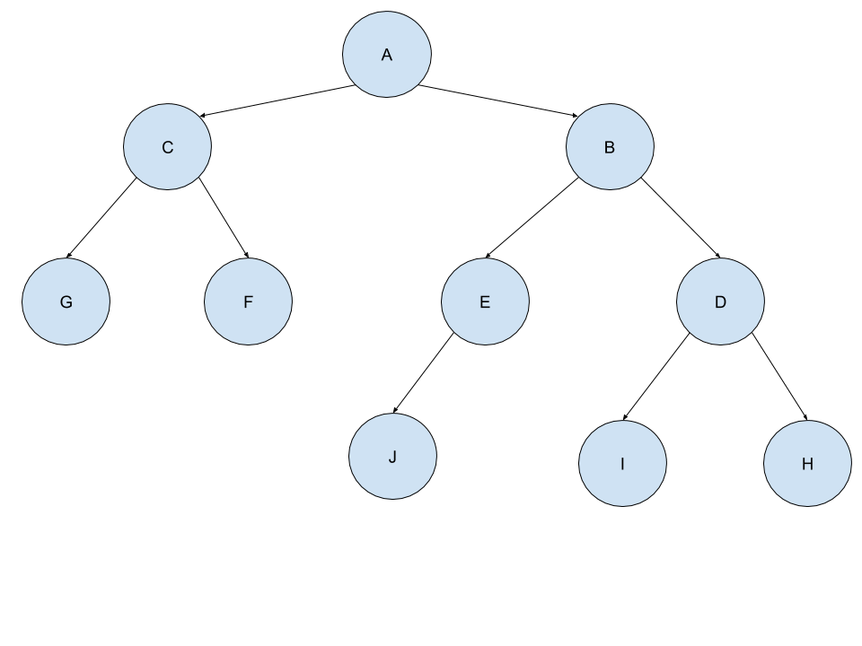
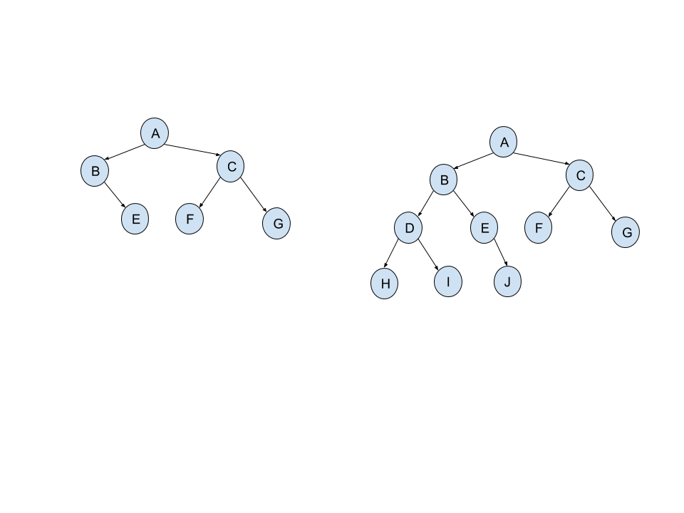

Original tree:

- Tree search visual explanation

    Breadth first search
    
    
    
    Depth first search (preorder)
    
    
    
- Mirror: returns the tree mirrored (see image for better understanding)
    
    From the original:
    
    
    
    To:
    
    
    
- Spread: returns the tree with the first element spread in all the tree
     
    From the original:
    
    
    
    To:
    
    
    
- Prefix: Returns True if a tree is a prefix of other:
    
    Example of a tree that is a prefix of other:
    
