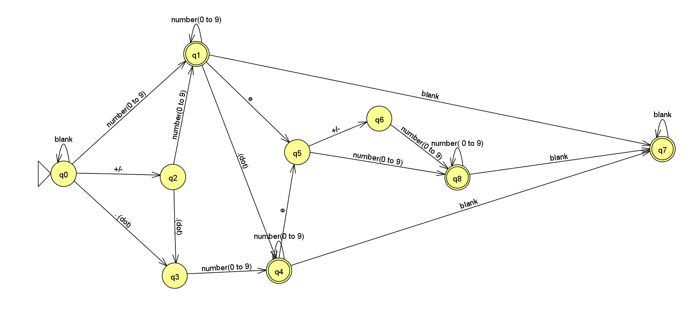

- IsSubString: Recursive method to know if a word "x" belongs to other "y". isSubString(x, y).

- ValidNumbers: Leetcode exercise https://leetcode.com/problems/valid-number/description/ 
  - Recursive version working 85% of the test cases.
  - Deterministic finite automata version 100% acceptance
    
    Used JFLAP to create it
    

- IsPalindrome recursive version 
